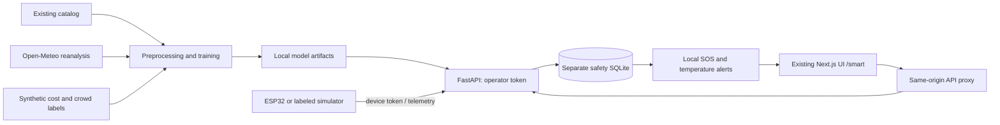

# ML & IoT extension — final-year project guide

This extends the existing Bangladesh Tourist Guide. It does not replace the original design or pretend its demo login is production authentication. Run the new end-to-end flow at `/smart`.

## Quick start (macOS/Linux; Windows via WSL)

Requirements: Node.js 20+ and Python 3.11+. The tested environment is recorded in `docs/VERIFICATION.md`. A laptop CPU is sufficient; no GPU, paid API, cloud database or LLM key is required.

```bash
bash scripts/setup.sh
bash scripts/run.sh
```

Open http://localhost:3000/smart. Copy the operator token from `.env.safety` into the connection form. Never commit or share this file. Setup preserves existing `.env` and `.env.safety`. It installs dependencies, exports the repository's destinations, generates the synthetic extension datasets and trains the models; it does not reset the original Prisma database.

For a fresh historical weather download, run `bash scripts/setup.sh --download`, or after setup:

```bash
.venv/bin/python -m backend.download
.venv/bin/python -m backend.synth_data
.venv/bin/python -m backend.train
bash scripts/test.sh
```

The bundled raw weather file supports offline retraining after dependencies are installed. If it is absent, training explicitly reports synthetic weather features. A failed download stops the download command rather than quietly substituting fabricated observations. The UI still needs its first dependency install and may fetch the original Google font at build time.

The original Prisma schema and seed remain available through `npm run db:push` and `npm run db:seed`. They are not required by the new ML/safety backend, which creates its own SQLite schema automatically. Avoid reseeding an existing database without a backup.

## What works, and what is simulated

| Component | Actual implementation | Limitation |
|---|---|---|
| Existing tourism UI | Preserved destination, planning, budget, transport and emergency pages | Existing planner/chat/login/maps remain demo or rule-based where they were before |
| Destination recommendation | Fitted TF-IDF cosine similarity, daily-budget filter, geographic distance weighting | 12 existing catalog entries; no collected user relevance labels; English keywords |
| Trip cost | Trained Random Forest regression, persisted artifact and prediction API | Synthetic cost labels from unverified catalog estimates; not market prices |
| Crowd scenario | Trained Random Forest, date/weekend/rain inputs, chronological evaluation | Synthetic 0–100 index for Cox's Bazar; not actual counts or live prediction |
| Traveler clustering | K-Means (k=4) on scaled synthetic itinerary features; named segments surfaced in the UI | Synthetic itinerary generation; not learned from real travelers |
| Hotel price estimator | RandomForest on synthetic hotel quotes with engineered season/room features | Catalog-style nightly prices; not actual booking quotes |
| Review sentiment | LogisticRegression on TF-IDF review text, 1–5 classes | Synthetic review templates; not trained on real reviews |
| Demand forecast | Ridge regression on month + 1- and 12-month lag features | Synthetic monthly visitor counts; not official statistics |
| Telemetry anomaly | IsolationForest on synthetic telemetry baseline | Synthetic baseline; not a medical or safety advice |
| Best season classifier | DecisionTree over per-destination synthetic demand peaks | Tiny synthetic dataset (12 rows); not a substitute for actual seasonality research |
| Weather dataset | Downloaded Open-Meteo daily reanalysis; preprocessing, checksum and source manifest | Gridded reanalysis is not locally measured ground truth; no visitor-count labels |
| Backend | FastAPI validation, token authentication, SQLite persistence, OpenAPI | One trusted project operator, not a public multi-user platform |
| Safety UI | Register/revoke devices, GPS readings, stale indicator, SOS and heat alerts, acknowledgement | Acknowledgement only changes a database record; no police, SMS or emergency dispatch |
| Python/browser simulator | Sends real HTTP requests that persist real records, marked simulated | Coordinates and readings are generated fixtures |
| ESP32 code | GPS UART, DHT22, SOS interrupt, HTTP(S), retry and persistent pending SOS | Requires physical build and field testing; no cellular modem or certified safety assurance |

No native Android app, paid hotel integration, live ticket booking, official visitor dataset, emergency-service partnership or independent safety verification is claimed. Existing hotel/transport suggestions remain unverified sample estimates. User auth redesign, geofencing, route optimization and camera crowd detection are outside this minimal extension.

## Structure and architecture

```text
src/app/smart/page.tsx       New responsive dashboard, reuses existing UI components
next.config.js              Same-origin /api/smart/* proxy to FastAPI
backend/app.py              Authenticated recommendation, prediction and safety APIs
backend/schema.sql          Device / telemetry / alert persistence and cascades
backend/download.py         Reproducible weather download and provenance
backend/train.py            Preprocessing, training, baseline evaluation and artifacts
backend/simulate.py         End-to-end device simulator
backend/tests/              Auth, inference, SOS, validation and lifecycle tests
data/places.json            Export of existing repository destinations
data/raw/                   Weather response and source manifest
data/*-synthetic.csv        Reproducible generated training tables (not observations)
data/models/                bundle.joblib and metrics.json
iot/                        PlatformIO ESP32 prototype
scripts/                    Setup, run, export and test entry points
```



The original Prisma tourist database remains separate. No foreign-key relationship to its demo users is implied. The safety operator explicitly registers consented devices and can view all devices in this single-operator prototype.

## Model methodology and honest evaluation

1. Export existing destinations from the TypeScript catalog. Deduplicate by slug, reject missing essential fields and coordinates outside a broad Bangladesh bounding box; sort deterministically. This does not verify source descriptions or prices.
2. Fit TF-IDF on category, tags and short descriptions. Filter candidates whose catalog daily cost exceeds the requested per-person budget. Rank by 85% text similarity and 15% straight-line proximity from the provided starting point (Dhaka in the UI). The score is not a probability and distance is not a road-route estimate.
3. Generate 2,400 independent synthetic trips with a fixed random seed (42): days 1–14, travellers 1–6, catalog daily prices, travel distance 0–600 km, and multiplicative noise. Cost formula is `(days × daily_cost + distance_km × 4) × travellers × noise`; 4 BDT/km is an illustrative assumption. All records are artificial.
4. For the crowd demonstration, join 2022–2025 daily rain by date, removing nulls and duplicate dates. Month, Friday/Saturday weekend and rain drive a noisy synthetic target. These targets do not represent observed visitors. If source weather is absent, use labeled synthetic rain.
5. Train Random Forest regressors with fixed settings. Hold out 20% of independent synthetic trips; for crowd, train on 2022–2024 and test on 2025. Compare MAE and R² with a mean predictor fitted on training data only. Rain is contemporaneous scenario input; this is not a future weather forecast.
6. `data/models/metrics.json` records actual measurements, split counts, feature order, library version, catalog hash, baseline results and warnings. Recommendation category precision@3 is only a metadata sanity check, not held-out relevance validation.

High synthetic scores do not prove tourist satisfaction, real expenditure accuracy or reliable crowd forecasting. Collect consented, anonymized actual trip expenses and destination/day visitor counts before making those claims. For research, reserve unseen dates and travellers, compare against simple baselines, report uncertainty and subgroup errors, and obtain institution-required ethics approval. Never train on identifiable GPS traces without explicit consent.

## Data sources and licenses

- Existing `src/lib/data/bangladesh.ts`: user-provided catalog reused without new scraping; prices and descriptive claims are unverified. Do not redistribute existing photos/text without checking their original licenses.
- [Open-Meteo Historical Weather API](https://open-meteo.com/en/docs/historical-weather-api): Cox's Bazar coordinates, 2022-01-01 through 2025-12-31; daily max temperature and precipitation. Only precipitation is used by this model. Attribution: Weather data by Open-Meteo, based on reanalysis models. Data are CC BY 4.0; the free service is for non-commercial use under its [terms](https://open-meteo.com/en/terms). Preserve `weather-manifest.json` and attribution when distributing data.
- [Wikidata structured data](https://www.wikidata.org/wiki/Wikidata:Licensing) was evaluated as an optional CC0 source. It was not downloaded because this repository already contains a suitable small destination catalog; it does not supply the missing expense/crowd labels.
- Generated CSVs are explicitly named `*-synthetic.csv`. They contain no real travellers, and are included solely for reproducible teaching experiments.

## API contract

Backend health: `GET http://127.0.0.1:8000/health`. Interactive schema: http://127.0.0.1:8000/docs (endpoints still require the Authorization header). Frontend requests use `/api/smart/` instead of `/api/`.

| Method | Backend path | Auth / body |
|---|---|---|
| GET | `/api/models`, `/api/places` | Operator Bearer token |
| POST | `/api/recommend` | Operator; interests, daily_budget, latitude, longitude, limit |
| POST | `/api/predict/cost` | Operator; slug, days, travellers, distance_km |
| POST | `/api/predict/crowd` | Operator; date (YYYY-MM-DD), rain_mm |
| POST | `/api/devices` | Operator; name, simulated, consent=true; returns token ONCE |
| POST | `/api/telemetry` | Device Bearer token; event_id, recorded_at, optional coordinates/sensors, sos |
| GET | `/api/safety` | Operator; devices and latest 100 alerts |
| POST | `/api/alerts/{id}/ack` | Operator; marks local acknowledgement |
| DELETE | `/api/devices/{id}` | Operator; revokes device and cascades readings/alerts |

Every JSON model forbids unknown fields and validates bounds. Unknown places give 404, bad inputs 422, missing/invalid credentials 401. Device identity is derived from its token, never a caller-supplied device ID. Both GPS coordinates must be supplied or both null. A timezone-aware timestamp is required; future clock errors above five minutes and readings older than seven days are rejected. Out-of-order packets do not replace a newer displayed position. Event IDs are unique per device so retries do not duplicate alerts; a repeated ID retains the original event and ignores the retried payload.

Example sensor body:

```json
{"event_id":"boot1-1","recorded_at":"2026-08-31T06:00:00Z","latitude":21.4272,"longitude":92.0058,"temperature":31,"humidity":76,"sos":true}
```

Use the actual current timestamp when sending. Example CLI demo:

```bash
set -a
source .env.safety
set +a
.venv/bin/python -m backend.simulate --count 5 --sos
```

## Privacy, security and deployment boundary

- Default servers bind to localhost. The proxy forwards the browser's operator token only to the fixed configured backend. There is no permissive CORS and no token in localStorage, URL or bundled frontend code.
- Operator secret is randomly generated; startup rejects values shorter than 32 characters. Device secrets are random and stored only as SHA-256 hashes in SQLite. A device token cannot list readings, register other devices or acknowledge alerts.
- Seven-day pruning runs on telemetry ingest and safety reads. It is opportunistic, not an independently scheduled erasure job: when the app is idle, files remain until the next request. Deletion is logical; SQLite/WAL, filesystem backups and SSD blocks may retain recoverable bytes. Full regulatory erasure is not claimed.
- Changing the operator token and restarting revokes operator sessions. Deleting and registering a device rotates its token and erases its associated records. `.env.safety` and real hardware `config.h` are git-ignored. Never ship them in a report/archive.
- Only load the repository's own trusted `.joblib` file. Python pickle-based artifacts can execute code; retrain rather than load downloaded models from strangers.
- This is a trusted, single-operator local demo. Existing demo auth is not hardened. No per-user RBAC, audit log, perimeter rate limiting, encrypted database, production monitoring or penetration test is included. Do not expose it directly to the public internet. A real deployment needs HTTPS, stronger identity controls, threat review and real hardware testing.

## ESP32 assembly and demo

Hardware: ESP32 DevKit, compatible UART GPS module (e.g. NEO-6M), DHT22, momentary SOS switch, breadboard and jumper wires. Use a suitable USB supply; battery/charging design is outside this prototype. Check each board's voltage specifications before wiring.

| Signal | ESP32 connection |
|---|---|
| GPS TX (3.3 V logic) | GPIO16 / UART RX |
| GPS RX (optional) | GPIO17 / UART TX |
| DHT22 DATA | GPIO4; 10 kΩ pull-up to 3.3 V for bare sensors |
| SOS switch | GPIO27 to GND; internal pull-up enabled |
| Status LED | GPIO2 onboard (board-dependent) |
| Grounds | Common GND; sensor power per module specification |

Never put 5 V logic into ESP32 GPIO. GPS satellite lock generally requires outdoor testing. Register a **real ESP32 prototype** in `/smart`, copy `iot/include/config.example.h` to `config.h`, then insert its device token and Wi-Fi credentials. Prefer HTTPS with the actual root CA; certificate validation is enabled and never bypassed.

For an isolated, trusted LAN bench demonstration only, set `ALLOW_INSECURE_LAN_HTTP=true`, set API_URL to `http://YOUR_LAPTOP_LAN_IP:8000/api/telemetry`, and run `TOURIST_BIND=0.0.0.0 bash scripts/run.sh`. This sends the device token and locations unencrypted; do not use public Wi-Fi or real tourist data. The browser can remain on localhost. Firewall access and same-network connectivity are needed. Use a phone hotspot if it permits peer connections; there is no GSM/SIM support.

```bash
python3 -m pip install platformio
cd iot
pio run
pio run --target upload
pio device monitor
```

Firmware samples every 15 seconds and retries pending SOS every five seconds. Null GPS means no recent fix; it never fabricates coordinates. A pending SOS payload is stored in ESP32 NVS before sending and retried with the same event ID after reboot. Interrupt-latched button presses survive short blocking network operations. LED on means queued, not rescued. Multiple presses can coalesce while a pending event exists; this is not a durable multi-event queue. Normal telemetry is not stored offline. A clock sync is required before forming an event: a pre-sync press is remembered, but its recorded timestamp becomes the later capture time, not the exact press time. The default NVS storage/token configuration is not encrypted against physical extraction. Delivery status in serial does not mean a human saw the alert.

Bench acceptance checklist: outdoors obtain a fix; confirm readings in UI; press SOS; retry same payload and verify one alert; disconnect Wi-Fi and press SOS; reboot/reconnect and verify pending delivery; test no-GPS SOS and a revoked token. Pending events older than the server's seven-day limit require manual recovery/clearing and must not be treated as delivered. No emergency-service integration exists.

## Viva/demo outline

1. Explain that the original app is reused and the new ML/IoT functionality is isolated at `/smart`.
2. Show raw provenance, processed CSVs, training code and held-out baseline metrics.
3. Change interests/budget, compare recommendations and demonstrate cost/crowd scenarios.
4. Register a simulated device with consent; send a reading and SOS; acknowledge locally.
5. Show unauthorized requests fail, duplicates do not create repeated alerts and revocation erases records.
6. If hardware is available, repeat the sensor/SOS flow and document actual field results separately.
7. State limitations candidly: synthetic targets, tiny catalog, local operator auth and no rescue dispatch.

Technical references: [scikit-learn RandomForestRegressor](https://scikit-learn.org/stable/modules/generated/sklearn.ensemble.RandomForestRegressor.html), [Espressif Arduino Wi-Fi](https://docs.espressif.com/projects/arduino-esp32/en/latest/api/wifi.html).
